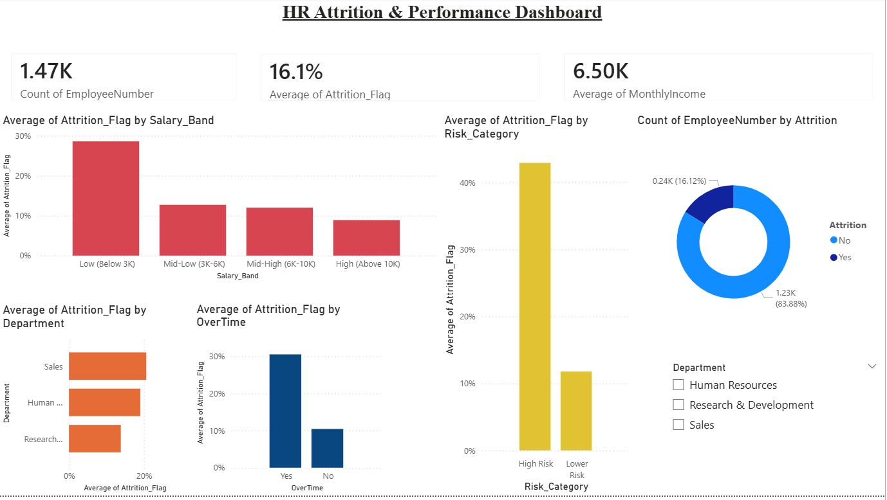
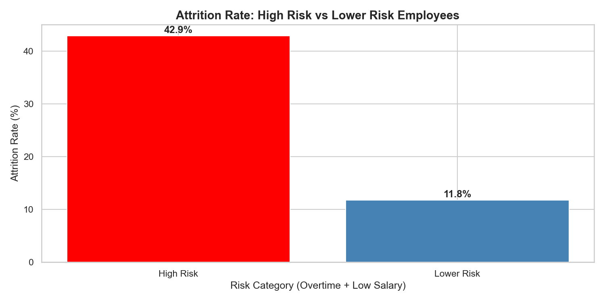
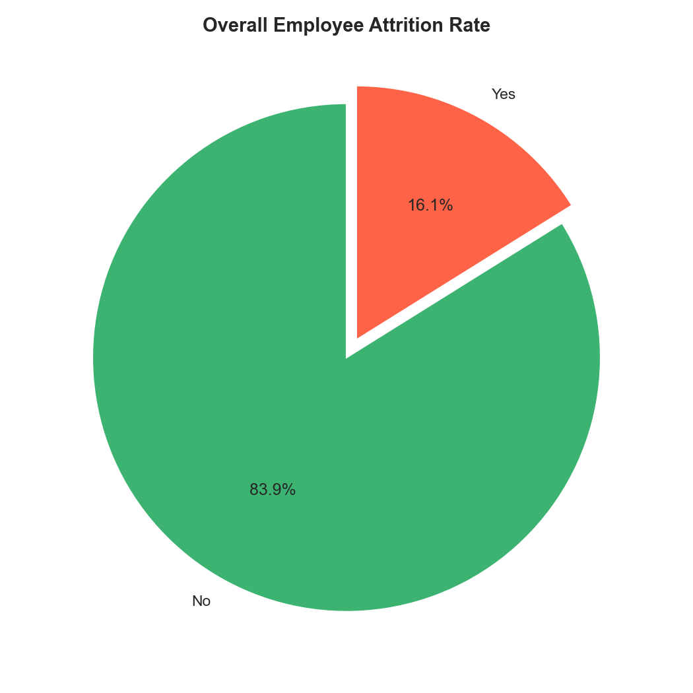
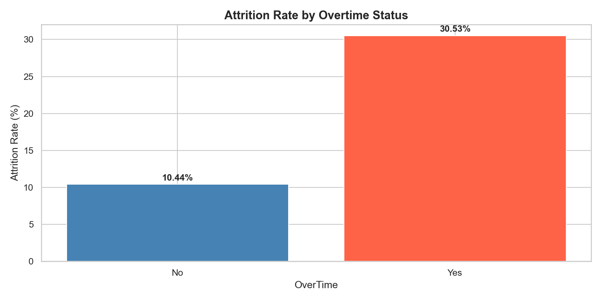
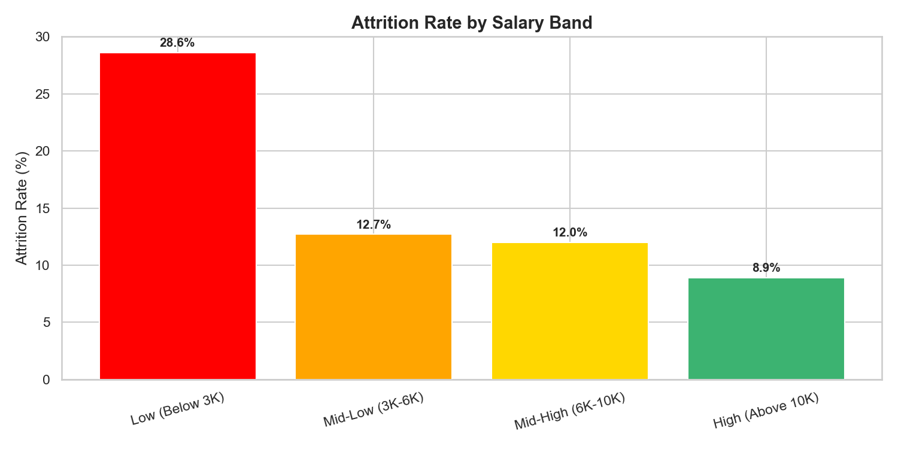
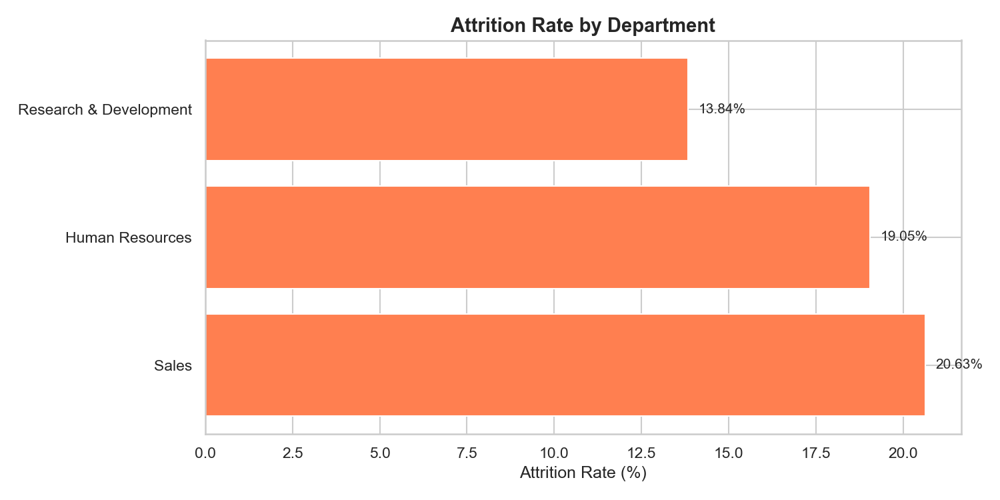
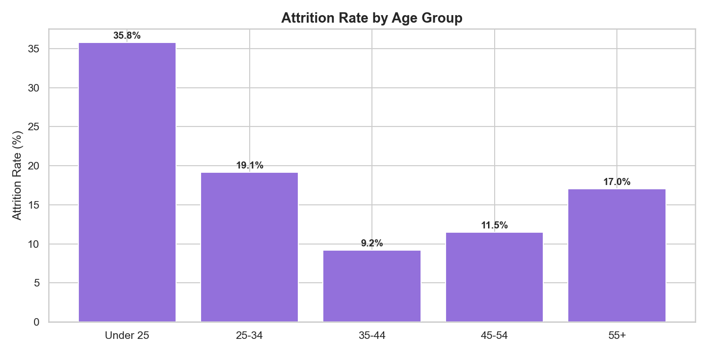
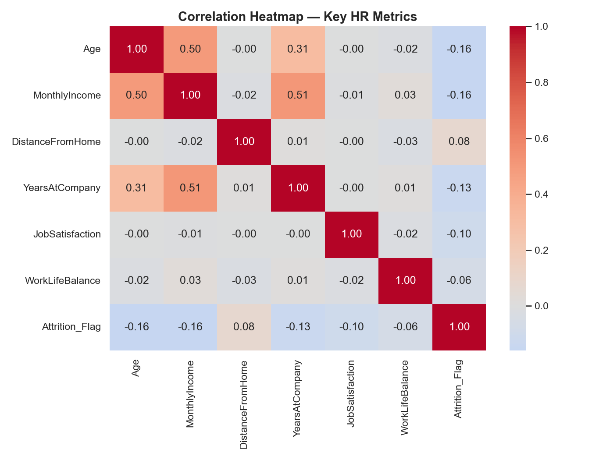

# 👥 HR Analytics — Employee Attrition & Performance Analysis



## 📌 Project Overview
An end-to-end HR analytics project analyzing 1,470 employee records to uncover the key drivers behind employee attrition. The project identifies which employee segments are at the highest risk of leaving and quantifies exactly how much overtime, compensation, age and department impact retention — translating raw HR data into specific, actionable retention strategies.

## 🛠️ Tools & Technologies
| Tool | Purpose |
|------|---------|
| MySQL | Database creation & SQL-based attrition analysis |
| Python (Pandas, Seaborn, Matplotlib) | Data cleaning, feature engineering & exploratory analysis |
| Power BI | Interactive multi-chart attrition dashboard |
| GitHub | Version control & project hosting |

## 📊 Dashboard Preview
The Power BI dashboard above includes 3 KPI cards, 5 interactive charts, and a Department slicer for live filtering. *(.pbix file available in `/dashboard`)*

## 🔍 Key Findings

### 1. 🔥 The Headline Finding: Overtime + Low Salary = 6x Attrition Risk
Employees who work overtime **and** earn below $5,000/month leave at a **42.93%** rate — nearly **6 times higher** than well-compensated employees with no overtime (6.86%). This combined risk factor is the single strongest predictor of attrition in the dataset.

| OverTime | Salary Category | Total Employees | Left | Attrition Rate |
|---|---|---|---|---|
| Yes | Low Salary | 205 | 88 | **42.93%** |
| Yes | Higher Salary | 211 | 39 | 18.48% |
| No | Low Salary | 544 | 75 | 13.79% |
| No | Higher Salary | 510 | 35 | 6.86% |

### 2. ⏰ Overtime Alone Nearly Triples Attrition
Employees working overtime leave at **30.53%**, compared to just **10.44%** for those who don't — almost a 3x difference, independent of any other factor.

### 3. 💰 Low Salary Is a Major Risk Factor
Employees earning below $3,000/month have a **28.6%** attrition rate — more than 3x higher than employees earning above $10,000/month (8.9%). Attrition drops steadily as salary increases.

### 4. 🧑‍💼 Sales Department Has the Highest Turnover
Sales leads all departments in attrition at **20.63%**, followed by Human Resources at 19.05%. Research & Development is the most stable department at 13.84%.

### 5. 🎂 Younger Employees Are a Flight Risk
Employees under 25 leave at **35.8%** — more than double the rate of any other age group. Attrition rate falls sharply with age, hitting its lowest point (9.2%) in the 35-44 group.

### 6. 📈 Correlation Confirms the Pattern
A correlation heatmap across key HR metrics confirms the story: Age (-0.16), MonthlyIncome (-0.16), and YearsAtCompany (-0.13) are all negatively correlated with attrition, while DistanceFromHome (+0.08) shows a small positive relationship — all directionally consistent with the findings above.

## 📁 Project Structure

    hr-analytics/
    │
    ├── data/
    │   ├── hr_attrition.csv            # Original raw dataset
    │   └── hr_clean.csv                # Cleaned dataset with engineered features
    │
    ├── sql/
    │   ├── 01_create_table.sql         # Database & table creation
    │   ├── 02_data_validation.sql      # Data verification queries
    │   └── 03_business_insights.sql    # 8 business insight queries
    │
    ├── notebooks/
    │   ├── 01_data_cleaning.ipynb      # Data cleaning & feature engineering
    │   └── 02_eda_analysis.ipynb       # Exploratory data analysis & visualizations
    │
    ├── dashboard/
    │   ├── hr_dashboard.pbix           # Power BI dashboard file
    │   └── screenshots/                # Exported chart images
    │
    └── README.md

## 🔄 Project Workflow
1. **Data Collection** → Sourced the IBM HR Analytics Employee Attrition dataset (1,470 employees) from Kaggle
2. **Database Setup** → Loaded data into MySQL, wrote 8 SQL queries covering department, role, salary, overtime, age and combined-risk attrition analysis
3. **Data Cleaning** → Verified zero missing values and zero duplicates; engineered new features in Python including Salary_Band, Age_Group and a combined Risk_Category flag
4. **EDA** → Built 7 visualizations in Seaborn/Matplotlib, including a correlation heatmap to validate findings statistically
5. **Dashboard** → Built an interactive Power BI dashboard with KPI cards, 5 charts and a Department slicer for live filtering
6. **Publishing** → Version controlled on GitHub with full documentation

## 📈 Visualizations

### Attrition Rate: High Risk vs Lower Risk Employees (Headline Chart)


### Overall Employee Attrition Rate


### Attrition Rate by Overtime Status


### Attrition Rate by Salary Band


### Attrition Rate by Department


### Attrition Rate by Age Group


### Correlation Heatmap — Key HR Metrics


## 🗄️ SQL Highlights

**Query — Overtime Impact on Attrition**
```sql
SELECT 
    OverTime,
    COUNT(*) AS Total_Employees,
    SUM(CASE WHEN Attrition = 'Yes' THEN 1 ELSE 0 END) AS Employees_Left,
    ROUND(SUM(CASE WHEN Attrition = 'Yes' THEN 1 ELSE 0 END) * 100.0 / COUNT(*), 2) AS Attrition_Rate_Pct
FROM hr_data
GROUP BY OverTime
ORDER BY Attrition_Rate_Pct DESC;
```
**Result:** OverTime = Yes → 30.53% attrition vs OverTime = No → 10.44%

**Query — Combined Risk: Overtime + Salary (Headline Finding)**
```sql
SELECT 
    OverTime,
    CASE 
        WHEN MonthlyIncome < 5000 THEN 'Low Salary'
        ELSE 'Higher Salary'
    END AS Salary_Category,
    COUNT(*) AS Total_Employees,
    SUM(CASE WHEN Attrition = 'Yes' THEN 1 ELSE 0 END) AS Employees_Left,
    ROUND(SUM(CASE WHEN Attrition = 'Yes' THEN 1 ELSE 0 END) * 100.0 / COUNT(*), 2) AS Attrition_Rate_Pct
FROM hr_data
GROUP BY OverTime, Salary_Category
ORDER BY Attrition_Rate_Pct DESC;
```
**Result:** Overtime + Low Salary → 42.93% attrition, the highest-risk segment in the company

## 💡 Business Recommendations
1. **Introduce a retention bonus for the "High Risk" segment** — employees working overtime on below-median salary leave at 6x the rate of well-compensated, non-overtime staff. Targeted pay adjustments here would have the highest ROI on retention spend.
2. **Audit overtime policy in Sales and HR** — these departments combine the highest attrition rates with high overtime exposure; redistributing workload could reduce burnout-driven exits.
3. **Build a structured onboarding/mentorship track for under-25 hires** — this group attrites at more than double the rate of any other age band, suggesting early-tenure disengagement rather than compensation alone.
4. **Review compensation bands below $3,000/month** — this group shows the highest salary-linked attrition (28.6%); even modest increases could meaningfully reduce turnover here.
5. **Use Years At Company and Job Satisfaction as early-warning signals** — both show meaningful negative correlation with attrition and could feed into a future predictive retention model.

## 📦 Dataset
- **Source:** [Kaggle - IBM HR Analytics Employee Attrition Dataset](https://www.kaggle.com/datasets/pavansubhasht/ibm-hr-analytics-attrition-dataset)
- **Size:** 1,470 employees × 35 attributes
- **Scope:** Demographics, compensation, job role, satisfaction scores, tenure and attrition status

## 🚀 How to Run This Project
1. Clone the repository
```bash
git clone https://github.com/SreejoyGarg/hr-analytics.git
```
2. Set up the MySQL database using the scripts in `/sql` (run in order: 01 → 02 → 03)
3. Run the Jupyter notebooks in `/notebooks` in order to reproduce the cleaning and EDA
4. Open `/dashboard/hr_dashboard.pbix` in Power BI Desktop to explore the interactive dashboard

## 👤 Author
**Sreejoy Garg**
- GitHub: [@SreejoyGarg](https://github.com/SreejoyGarg)
- LinkedIn: [Your LinkedIn](www.linkedin.com/in/sreejoy-garg-637829277)
